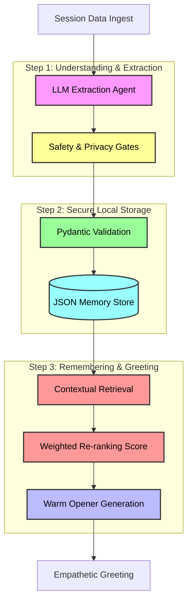

# Project Recall - CLI Version

Project Recall is a sophisticated, privacy-first contextual memory system designed to bridge the gap between robotic data retrieval and genuine human-centric interaction. This CLI version focuses on the core intelligence of therapeutic continuity, ensuring that AI-driven support feels as natural and safe as a conversation with a long-term mentor.

---

## Key Skills & Tech Stack

| Category | Technologies |
| :--- | :--- |
| **Logic & CLI** | **Python 3.10+**, **Typer** |
| **Data Integrity** | **Pydantic v2**, JSON-based Local Storage |
| **AI Orchestration** | **OpenRouter**, **DeepSeek-R1**, LLM-based Memory Extraction |
| **Memory Strategy** | **Advanced RAG**, Weighted Re-ranking, Contextual Retrieval |
| **UX & Presentation** | **Rich** (Terminal UI), Custom Emotional Tone Analysis |
| **Quality & Safety** | Safety-Aware Filtering, Privacy Gates, CRISIS-signal Detection |

---

## Why This Project Matters

For any therapeutic relationship, trust is built on the feeling of being truly heard and remembered. In many AI systems, memory feels like a cold database lookup—an awkward "I remember you said X" that misses the emotional weight behind the words. Project Recall changes this by treating memory as a living context.

Instead of just storing facts, the system captures the emotional resonance and unresolved themes of a conversation. This allows the AI to return to a new session with the warmth of a human professional who has spent time reflecting on your journey, ensuring that every "Welcome back" feels earned and authentic.

---

## System Architecture

The following diagram shows how the system processes information and remembers key details for future conversations.



---

## Core Features and Intelligence

### Privacy-First "Right to be Forgotten"
The system is built with user agency at its core. Therapeutic data is exceptionally personal, and the system allows for granular control over what remains in the "long-term" memory. When a memory is flagged for removal, it is cleared across the entire storage layer, ensuring no residual context remains.

### Sensitivity-Aware Retrieval
Not every memory is suitable for a greeting. Recalling a minor success in work is helpful; recalling a deeply traumatic event during a casual check-in can be harmful. The system categorizes every extracted memory by sensitivity (Low, Medium, High). High-sensitivity memories are stored for continuity but are strictly gated and never used for automated re-engagement or casual session openers.

### Dynamic Re-ranking and Retrieval
Memory retrieval is more than just "similarity search." Project Recall uses a multi-factor scoring algorithm to determine what is most relevant:
- **Importance (45%):** How critical was this moment to the user's journey?
- **Open Loops (30%):** Is there a planned action or an unresolved conflict that needs follow-up?
- **Actionability (25%):** Can this memory lead to a helpful, grounding conversation?

### Ethical Re-engagement Logic
The notification engine is designed to avoid the "retention hacks" of traditional apps. It only triggers when there is a clear therapeutic benefit—such as celebrating a milestone or following up on a stressful "open loop"—and it includes strict gates for crisis signals and notification fatigue.

---

## Demo Gallery

| Ingestion & Memory Extraction | Memory Transparency Table |
| :---: | :---: |
| .png) | .png) |

| Memory Transparency Table Continued | Intelligent Session Opener |
| :---: | :---: |
| .png) | .png) |

| Re-engagement Scenarios | Safety and Decision Logic |
| :---: | :---: |
| .png) | .png) |

| Success & Final Validation |
| :---: |
| .png) |

---

## Setup Instructions

1. **Navigate to folder:**
   ```bash
   cd Project_Recall_CLI_Version
   ```

2. **Create and activate Virtual Environment:**
   ```bash
   python -m venv .venv
   .\.venv\Scripts\activate  # Windows
   ```

3. **Install Dependencies:**
   ```bash
   pip install -r requirements.txt
   ```

## How to Run
Run the full end-to-end demo to see the system in action:
```bash
python -m app.cli demo
```
