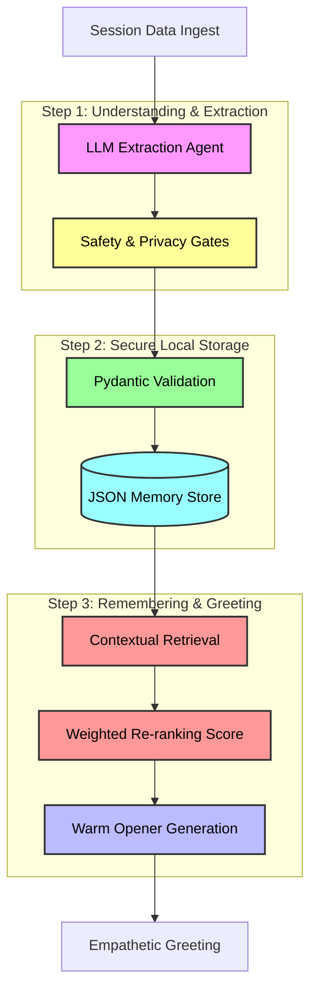

# Project Recall - CLI Version

Project Recall is a sophisticated, privacy-first contextual memory system designed to bridge the gap between robotic data retrieval and genuine human-centric interaction. This CLI version focuses on the core intelligence of therapeutic continuity, ensuring that AI-driven support feels as natural and safe as a conversation with a long-term mentor.

---

## Key Skills & Tech Stack

| Category | Technologies |
| :--- | :--- |
| **Logic & CLI** | **Python 3.10+**, **Typer** |
| **Data Integrity** | **Pydantic v2**, JSON-based Local Storage |
| **AI Orchestration** | **OpenRouter**, **DeepSeek-R1**, LLM-based Memory Extraction |
| **Memory Strategy** | **Advanced RAG**, Weighted Re-ranking, Contextual Retrieval |
| **UX & Presentation** | **Rich** (Terminal UI), Custom Emotional Tone Analysis |
| **Quality & Safety** | Safety-Aware Filtering, Privacy Gates, CRISIS-signal Detection |

---

## Why This Project Matters

In the world of AI, "feeling remembered" is the foundation of trust. However, traditional RAG (Retrieval-Augmented Generation) often falls into the "uncanny valley"—parroting sensitive facts back to the user in cold, awkward ways. 

Project Recall implements a **Multi-tiered Memory Architecture** that distinguishes between what someone is (core profile) and what someone is feeling (session themes). This creates a "Warm Opener" experience that mimics human memory: relevant, emotionally aware, and respectful of boundaries.

---

## System Architecture

The following diagram shows how the system processes information and remembers key details for future conversations.



---

## ✨ Features

- **Privacy-First "Right to be Forgotten":** Flexible memory management allows for secure handling of therapeutic context.
- **Sensitivity-Aware Retrieval:** High-sensitivity memories (e.g., trauma) are filtered out of casual re-engagement to prevent emotional distress.
- **Dynamic Re-ranking:** Memories aren't just retrieved by similarity; they are scored based on **Recency**, **Importance**, and **Unresolved Themes**.
- **Transparency & Control:** The CLI table view allows for a clear audit of what the system remembers, ensuring clinical accountability.

---

## Demo Screenshots

| Memory Extraction & Table View | Session Opener Generation |
| :---: | :---: |
| .png) | .png) |

| Notification & Re-engagement Scenarios |
| :---: |
| .png) |

---

## Setup Instructions

1. **Navigate to folder:**
   ```bash
   cd Project_Recall_CLI_Version
   ```

2. **Create and activate Virtual Environment:**
   ```bash
   python -m venv .venv
   .\.venv\Scripts\activate  # Windows
   ```

3. **Install Dependencies:**
   ```bash
   pip install -r requirements.txt
   ```

## How to Run
Run the full end-to-end demo to see the system in action:
```bash
python -m app.cli demo
```
