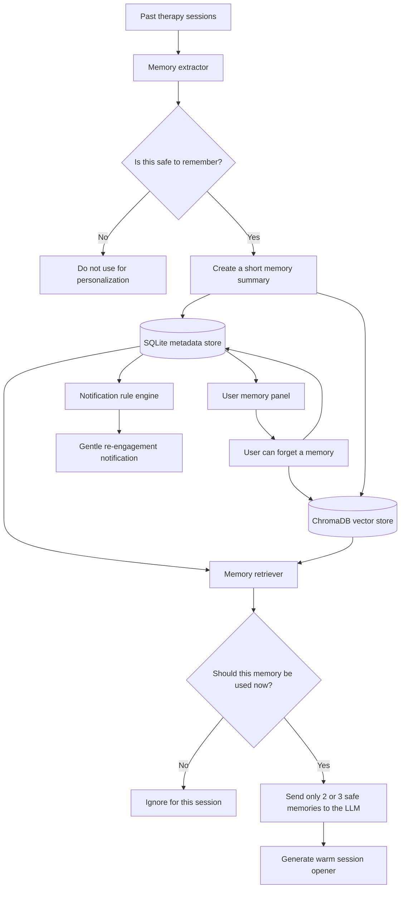

# Project Recall

Project Recall is an exploratory case study focused on the development of an AI therapist. 

> Help the AI remember what matters from past sessions, use that memory gently, and bring users back without sounding robotic, creepy, or unsafe.

This project is not a generic chatbot. It is a focused memory system that shows how an AI therapy product could extract useful context from previous sessions, store it safely, retrieve only what is relevant, and generate a warm session-opening message for a returning user.

---

## The Problem

A therapy conversation is not like a normal support chat.

If a user comes back after a few days, they do not want the AI to act like a stranger. They also do not want the AI to repeat sensitive details back at them in a cold or invasive way.

The original case study describes three product problems:

1. Around 40 percent of returning users feel the AI does not remember previous sessions.
2. Generic push notifications have low engagement.
3. Many users leave before the session reaches meaningful depth.

A normal AI assistant might solve this by sending the full chat history back into the model. That is not a good solution here.

It can be slow, expensive, noisy, and unsafe. More importantly, mental health conversations contain sensitive details. A good memory system should not remember everything. It should remember carefully.

---

## The Solution

Project Recall uses a lightweight memory architecture that sits between raw session transcripts and the AI response.

Instead of storing and replaying entire conversations, the system:

1. Ingests a small set of simulated therapy session transcripts.
2. Extracts structured memory summaries from each session.
3. Separates long-term patterns from short-term session details.
4. Filters out unsafe or overly sensitive memories.
5. Stores safe memories in both a relational database and a vector store.
6. Retrieves only the most relevant safe memories at the start of a new session.
7. Generates a warm opening message that references the past naturally.
8. Allows the user to see and forget what the AI remembers.
9. Uses rule-based logic to decide when a re-engagement notification should be sent.

The goal is not to make the AI sound clever. The goal is to make it feel considerate.

---

## What This Project Demonstrates

This project shows how I would approach memory in a mental-health-adjacent AI product.

It focuses on:

- Memory extraction
- Retrieval-augmented generation
- Safety filtering
- User control
- Notification logic
- Transparent UX
- Practical backend architecture
- Clear product tradeoffs

It is intentionally scoped as a prototype, but the architecture is designed in a way that could grow into a production system.

---

## Tech Stack

### Backend


### AI and Retrieval


### Frontend


### Testing


---

## Simple Explanation

Imagine a person talked to the AI last week about feeling anxious before work meetings.

A bad AI memory system might say:

> Your previous session theme was work anxiety. Emotional tone: anxious. Status unresolved.

That sounds like a database report.

A better AI memory system says:

> Welcome back. Last time, we touched on how work meetings had been feeling heavy, especially around taking on too much. Would it feel useful to check in on that today, or is something else more present?

That is the difference this project is trying to demonstrate.

The system does not just retrieve memory. It decides what is safe to remember, what is useful to bring up, and how to say it in a human way.

---

## System Architecture

This diagram shows the full flow in simple terms.



## Features

- Privacy-First "Right to be Forgotten": Users can explicitly exclude topics. The system performs a cascading delete across both vector and relational stores.
- Sensitivity-Aware Retrieval: High-sensitivity memories (e.g., trauma) are filtered out of casual re-engagement to prevent emotional distress.
- Dynamic Re-ranking: Memories aren't just retrieved by similarity; they are scored based on Recency, Importance, and Unresolved Themes.
- Transparency Panel: A dedicated UI section allows users to see exactly what the AI remembers about them, putting control back into their hands.

---

## Demo Screenshots

| Memory Transparency & Chat | Simulation Controls |
| :---: | :---: |
| .png) | .png) |

| Advanced Safety Audit |
| :---: |
| .png) |

---

## Setup Instructions

### Backend
1. cd backend
2. python -m venv .venv
3. source .venv/bin/activate (or .\.venv\Scripts\activate on Windows)
4. pip install -r requirements.txt
5. cp .env.example .env
6. uvicorn app.main:app --reload

### Frontend
1. cd frontend
2. npm install
3. npm run dev

---

## Known Limitations

This is a working prototype for a technical case study, not a production mental health product.

Current limitations:

1. The sessions used in the demo are simulated, not real user conversations.
2. The memory extraction quality depends on the selected LLM provider.
3. The safety classification is intentionally simple and would need clinical review before real deployment.
4. The system does not include real authentication, user accounts, or role-based access control.
5. The notification engine does not connect to a real push notification provider.
6. The ChromaDB vector store is local and not configured for production scale.
7. The SQLite database is suitable for the prototype but would need to be replaced or migrated for production.
8. The frontend is designed for demo clarity, not as a full therapy product.
9. The project does not implement a complete crisis escalation workflow.
10. The system does not provide medical advice, diagnosis, or treatment.
11. The prototype does not deeply handle multilingual sessions.
12. The evaluation is mostly functional; it does not yet include clinical safety evaluation or large-scale user testing.

---

## What I Would Build With 2 More Weeks

With more time, I would focus less on adding flashy features and more on making the memory system safer, easier to evaluate, and closer to production quality.

### 1. Stronger memory evaluation

I would create a small evaluation dataset with expected memory outputs and score each run on:

- whether the extracted memory is relevant
- whether sensitive details are handled correctly
- whether the memory should be stored at all
- whether it is safe to reference later
- whether the generated opener sounds warm and natural

This would make it easier to compare prompts, models, and retrieval settings.

### 2. Human review for sensitive memories

For a real mental health product, high-sensitivity memory behavior should not be shipped based only on developer judgment.

I would add a review workflow where clinical or safety reviewers can inspect:

- high-sensitivity memory categories
- notification copy
- unsafe retrieval examples
- false positives and false negatives from the safety filter

### 3. Better user control over memory

The current prototype supports viewing and forgetting memories.

I would extend this into a fuller memory control panel where users can:

- edit a memory
- pause a memory
- mark a memory as private
- decide which topics the AI is allowed to remember
- see why a memory was used in a session opener

### 4. Graph-based memory relationships

Right now, memories are mostly independent records.

I would add a graph layer that connects related themes, goals, and coping strategies.

Example:

```text
work meetings -> anxiety -> overcommitting -> boundary-setting goal -> coping plan
