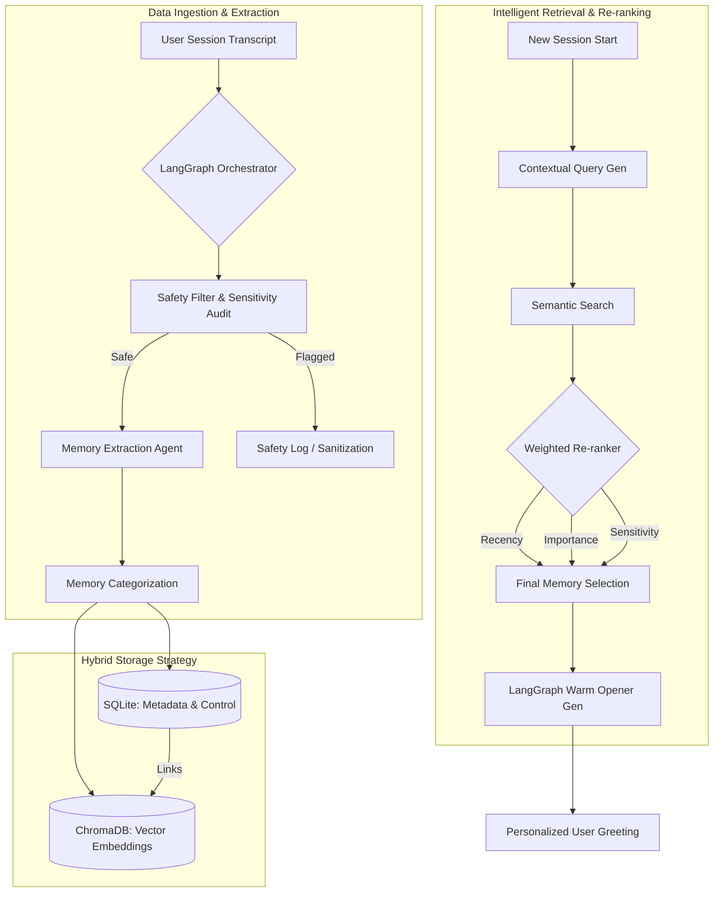

# Project Recall: Contextual Memory & Re-engagement System

Project Recall is a sophisticated, privacy-first contextual memory system designed to bridge the gap between robotic data retrieval and genuine human-centric interaction. Built for high-empathy applications, it utilizes an advanced agentic architecture to ensure users feel understood and remembered without compromising safety or privacy.

---

## 🛠️ Key Skills & Tech Stack

| Category | Technologies |
| :--- | :--- |
| **Agentic Framework** | **LangGraph**, LangChain |
| **Core AI / LLM** | **DeepSeek-R1** (via Ollama/OpenRouter), LLM-based Safety Filtering |
| **Retrieval Architecture** | **Advanced RAG**, Semantic Search, Custom Re-ranking Algorithms |
| **Backend Orchestration** | **Python 3.11**, **FastAPI**, Pydantic v2 |
| **Database & Storage** | **ChromaDB** (Vector Store), **SQLAlchemy** (SQLite - Metadata) |
| **Frontend Interaction** | **React 19**, **TypeScript**, Vite, **Tailwind CSS**, Lucide Icons |
| **Testing & Quality** | Pytest, Pytest-asyncio |

---

## 🧠 Why This Project Matters

In the world of AI, "feeling remembered" is the foundation of trust. However, traditional RAG (Retrieval-Augmented Generation) often falls into the "uncanny valley"—parroting sensitive facts back to the user in cold, awkward ways. 

Project Recall implements a **Multi-tiered Memory Architecture** that distinguishes between what someone *is* (core profile) and what someone is *feeling* (session themes). This creates a "Warm Opener" experience that mimics human memory: relevant, emotionally aware, and respectful of boundaries.

---

## 📐 Advanced System Architecture

The following diagram illustrates the agentic flow of session ingestion, safety auditing, and intelligent memory retrieval.

---

## ✨ Features

- **Privacy-First "Right to be Forgotten":** Users can explicitly exclude topics. The system performs a cascading delete across both vector and relational stores.
- **Sensitivity-Aware Retrieval:** High-sensitivity memories (e.g., trauma) are filtered out of casual re-engagement to prevent emotional distress.
- **Dynamic Re-ranking:** Memories aren't just retrieved by similarity; they are scored based on **Recency**, **Importance**, and **Unresolved Themes**.
- **Transparency Panel:** A dedicated UI section allows users to see exactly what the AI remembers about them, putting control back into their hands.

---

## 📸 Demo Screenshots

| Memory Transparency & Chat | Simulation Controls |
| :---: | :---: |
| .png) | .png) |

| Advanced Safety Audit |
| :---: |
| .png) |

---

## 🚀 Setup Instructions

### Backend
1. `cd backend`
2. `python -m venv .venv`
3. `source .venv/bin/activate` (or `.\.venv\Scripts\activate` on Windows)
4. `pip install -r requirements.txt`
5. `cp .env.example .env`
6. `uvicorn app.main:app --reload`

### Frontend
1. `cd frontend`
2. `npm install`
3. `npm run dev`

---

## 🔄 Demo Flow
1. **Reset Demo**: `POST /api/demo/reset` (Clears DBs)
2. **Ingest Samples**: `POST /api/ingest` (Ingests 5 simulated sessions)
3. **Start Session**: `POST /api/session/start` (Retrieves memories and generates warm opener)
4. **View Memories**: `GET /api/memories/demo_user` (Transparency panel)
5. **Forget Memory**: `POST /api/memories/exclude` (User-controlled deletion)
