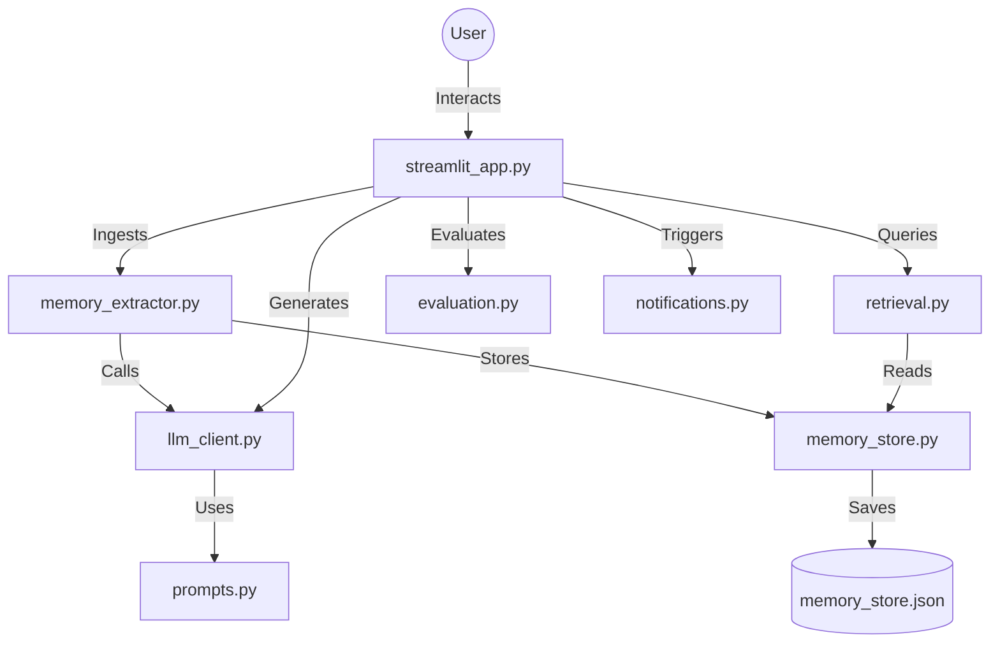

# Mentra Recall: AI Therapy Memory System (Streamlit Edition)

This is the Streamlit-powered prototype of **Project Recall**, an exploratory system designed for AI mental-health companions. 

> "Help the AI remember what matters, use that memory gently, and bring users back without sounding robotic, creepy, or unsafe."

---

## The Vision
In therapy, being remembered is the foundation of trust. If an AI therapist treats you like a stranger every time you return, the therapeutic alliance breaks. Project Recall demonstrates a "Careful Memory" architecture that extracts durable themes from sessions and retrieves them contextually to provide a warm, human experience.

---

## Architecture Overview
The system follows a modular RAG (Retrieval-Augmented Generation) pipeline:



1.  **Durable Extraction**: Post-session, the system identifies stress triggers, coping strategies, and personal goals.
2.  **Fingerprint Deduplication**: Uses SHA-256 hashing to ensure the AI doesn't remember the same thing twice.
3.  **Contextual Retrieval**: A weighted scoring engine (Overlap + Importance + Recency + Open Loops) finds the exact context needed for the current conversation.
4.  **Warm Generation**: A multi-prompt system that distinguishes between **Session Openers** (greetings) and **Chat Responses** (active support).

---

## Technical File Mapping
Each file in the `app/` directory serves a specific role in the RAG lifecycle:

| File | Purpose |
| :--- | :--- |
| `streamlit_app.py` | **Main Entry Point**. Handles the UI layout, multi-tab navigation, and session state management. |
| `app/memory_extractor.py` | **The Brain**. Processes raw transcripts and converts them into structured memory objects using the LLM. |
| `app/memory_store.py` | **The Vault**. Handles fingerprint-based deduplication and persistent storage of memories to JSON. |
| `app/retrieval.py` | **The Librarian**. Implements the weighted keyword scoring algorithm to find relevant memories. |
| `app/llm_client.py` | **The Bridge**. Manages communication with the OpenRouter API and provides deterministic fallbacks. |
| `app/prompts.py` | **The Voice**. Contains all the clinical and conversational instruction templates for the AI. |
| `app/evaluation.py` | **The Critic**. Runs the 5-point evaluation suite (Coverage, Recall, Warmth, Safety, Latency). |
| `app/notifications.py` | **The Connector**. Implements rule-based logic for re-engagement based on therapeutic signals. |
| `app/schemas.py` | **The Blueprint**. Defines the Pydantic models used to enforce data integrity across the system. |
| `app/utils.py` | **The Helper**. Provides SHA-256 hashing for deduplication and timestamp formatting. |

---

## Visual Tour

### Dashboard & Session History
| Input Transcripts | Memory Extraction |
| :---: | :---: |
| .png) | .png) |

### Intelligent Interaction
| Contextual Opener | Dynamic Chat |
| :---: | :---: |
| .png) | .png) |

### Transparent Evaluation
| RAG Scoring | Safety & Performance |
| :---: | :---: |
| .png) | .png) |

---

## Key Features
- **Privacy-First Storage**: We store structured summaries, not raw audio or tangents.
- **Explainable AI**: Every response shows the exact memories used and their retrieval scores.
- **Safety Gates**: Sensitive memories are automatically excluded from re-engagement notifications.
- **Real-Time Evaluation**: Built-in metrics for Warmth, Specificity, Safety, and Latency.

---

## Tech Stack
- **UI**: Streamlit (Python)
- **Logic**: Pydantic, Python 3.11
- **LLM**: OpenRouter API (Google Gemini 2.0 Flash Lite)
- **Database**: Local JSON storage with hash-based deduplication

---

## Setup Instructions

1. **Navigate to the directory**:
   ```bash
   cd Streamlit_UI_Version
   ```

2. **Set up your environment**:
   ```bash
   python -m venv venv
   .\venv\Scripts\activate
   pip install -r requirements.txt
   ```

3. **Configure your API Key**:
   Create a `.env` file (copy from `.env.example`):
   ```env
   OPENROUTER_API_KEY=sk-or-v1-...
   MOCK_LLM=false
   ```

4. **Run the application**:
   ```bash
   streamlit run streamlit_app.py
   ```

---

## Evaluation Metrics
For this prototype, we measure success across 5 core dimensions:
- **Memory Extraction Coverage**: Did we find all 6 expected durable themes?
- **Retrieval Recall @ 3**: Is the most relevant context in the top results?
- **Human Recall Score**: A combined metric for Warmth + Specificity.
- **Safety Filter**: 0 violations on sensitive data usage.
- **Total Latency**: Target of < 2 seconds for a seamless experience.

---

## Known Limitations & Roadmap
- **Semantic Search**: Currently uses keyword-weighted matching; future versions will include vector embeddings.
- **Clinical Rubrics**: Evaluation is currently heuristic-based; real deployment would require clinical validation.
- **Frequency Capping**: Rule-based notification logic is a prototype and not yet connected to a push service.

---

*This project was built as a technical assessment for the Mentra AI Engineering role.*
